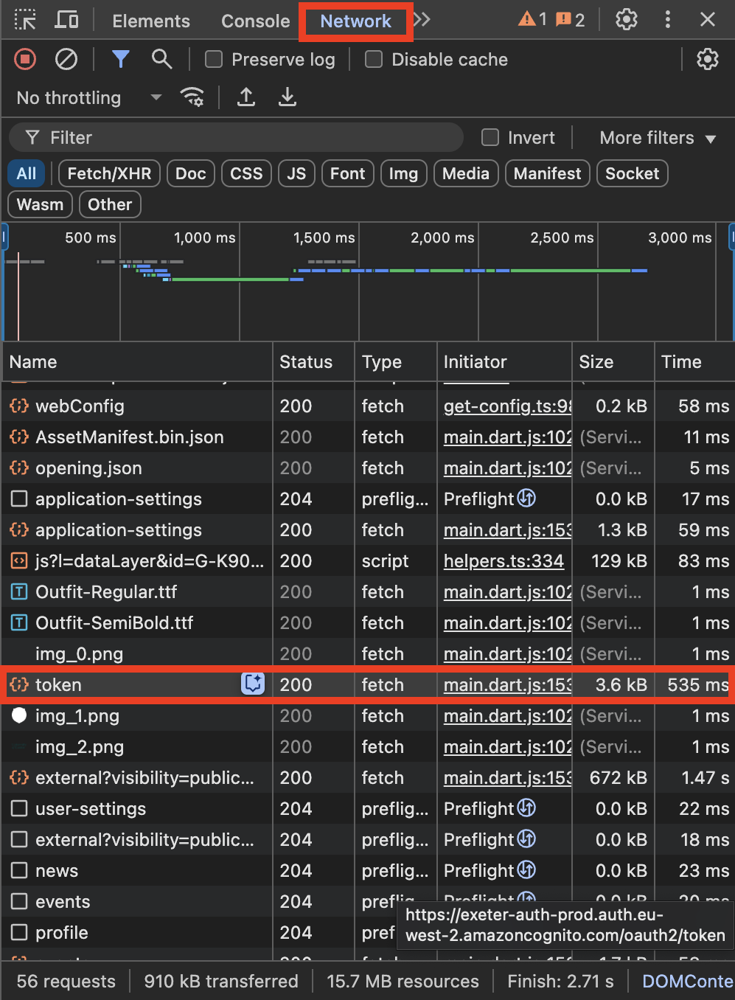
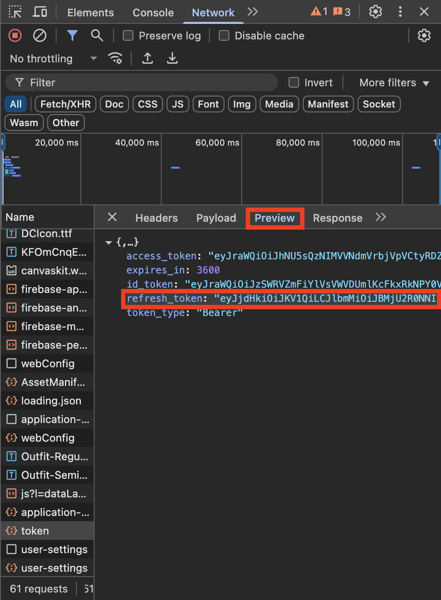
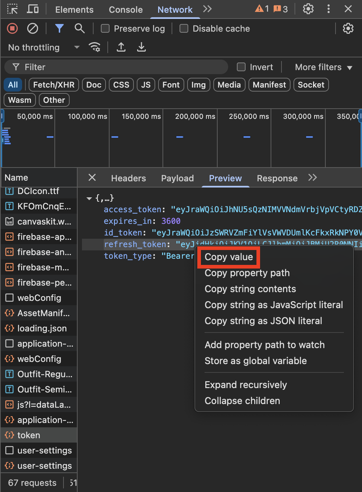

# Exeter-Check-In

**Exeter-Check-In** is an automated Python script that helps users check in to their timetable events.

## Description

This script automatically checks you in to scheduled events by simulating the check-in process. It requires minimal setup and will determine the correct event to check-in to, based on the current time.

## Set Up
Authentication is required to use the check in script. The `refresh_token` required for authentication will expire every **_30 days_**. To continue using the script, repeat these steps here every time the token expires.

IMPORTANT: Complete steps 1 ~ 3 **_before_** moving on to step 4.

1. Open a new tab in your browser.
2. Open the browser's developer tools (inspect element).
3. Go to the **Network** tab.
4. Visit `m.exeter.ac.uk` on the same tab, while keeping the **Network** tab open.
5. Find the request to the `token` endpoint. If you can't find it, try again after 10 mins or try in incognito mode.



6. Go to the **Preview** tab where the `refresh_token` value should be.



7. Right click the quoted text next to `refresh_token` and click `Copy value`



8. Open a new tab in your terminal.
9. If you're on **_Windows_**, install `tzdata`
   ```bash
   pip install tzdata
   ```
10. Navigate to the project directory:
   ```bash
   cd path/to/Exeter-Check-In
   ```
11. Run the script:
   ```bash
   python3 src/main.py
   ```
12. Paste the refresh token and hit enter, for example:
   ```
   $ python3 src/main.py

   Last modified time for refresh_token.txt:
   None

   Enter refresh_token.txt value: eyJjdHkiOiJKV1QiLCJlbmMiOiJBMjU2R0NNIiwiYW...
   ```

## Usage

Run the script at the time of your event. The script will determine which event is scheduled and complete the check-in process automatically.

1. Open a new tab in your browser.
1. Navigate to the project directory:
   ```bash
   cd path/to/Exeter-Check-In
   ```
1. Run the script:
   ```bash
   python3 src/main.py
   ```

If you want to manually select which event to check-in to, run the script with the `--manual` flag:
```bash
python3 src/main.py --manual
```